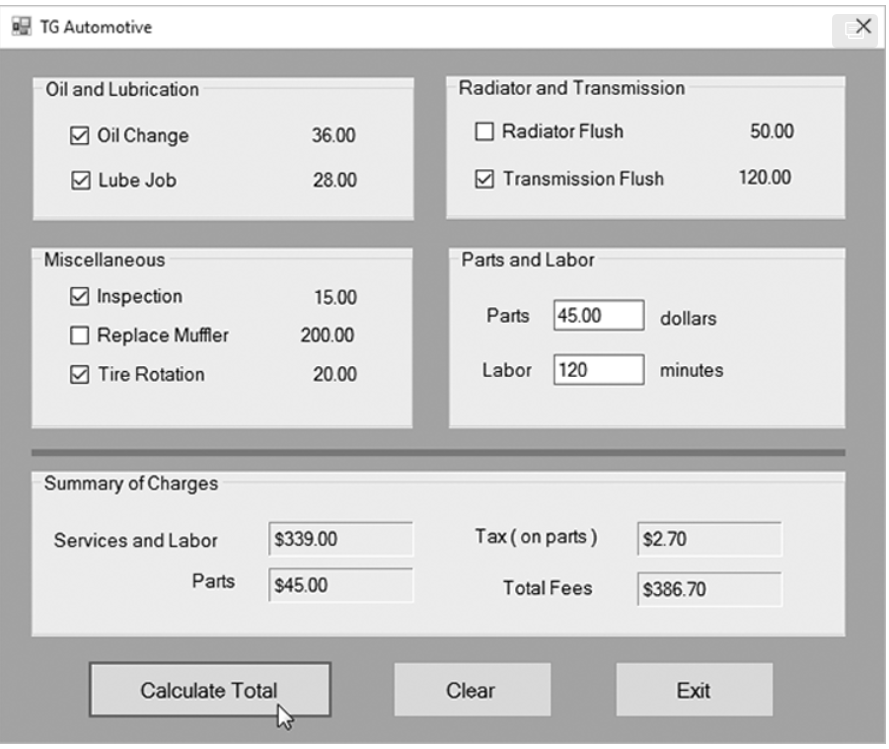

# TG Automotive

#### Assignment ID: CA01

The TG Automotive repair company performs the following routine maintenance services on passenger automobiles:

- Oil change—$36.00
- Lube job—$28.00
- Radiator flush—$50.00
- Transmission flush—$120.00
- Inspection—$15.00
- Muffler replacement—$200.00
- Tire rotation—$20.00

TG Automotive also performs other nonroutine services and charges for parts and labor ($60 per hour). Create an application that displays the total for a customer’s visit to the shop. A sample user interface for the application appears in the figure. Your source code should contain functions, such as the ones listed here, that validate inputs and calculate the various parts of the bill:

```
/**
 * Verify that the two input valuesa re valid number and neither is less that zero
 */ 
private bool validateInputs()
{
    return true;
}

/**
 * Calculate all oil and lubrication charges
 */ 
private decimal calcFlushCharges()
{
    return 0.0m;
}

/**
 * Calculate inspection, muffler, and tire rotation charges
 */ 
private decimal calcMiscCharges()
{
    return 0.0m;
}

/**
 * Calculate and display the total of all charges, including labor, parts, and services
 */ 
private void calculateTotalCharges()
{

}
```



Also, create procedures, such as the ones listed here, that are called when the user clicks the *Clear* button:

```
/**
 * Calculate and display the total of all charges, including labor, parts, and services
 */ 
private void calculateTotalCharges()
{

}

/**
 * Reset the oil change and lube job check boxes
 */ 
private void clearOilLube()
{

}
/**
 * Clear the radiator and transmission flush check boxes
 */ 
private void clearFlushes()
{

}

/**
 * Clear the inspection, muffler replacement, and tire rotation check boxes
 */ 
private void clearMisc()
{

}

/**
 * Clear the parts and labor check boxes
 */ 
private void clearOther()
{

}
```